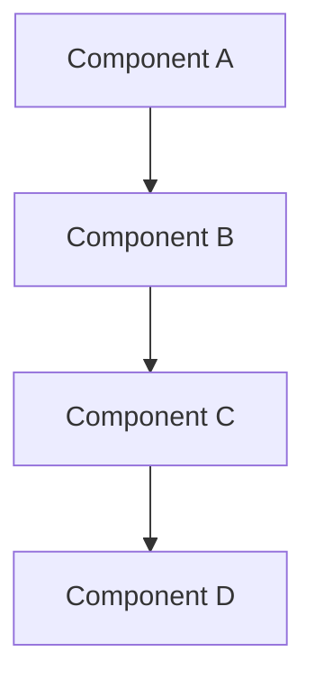

# Documentation Templates

## 📋 Template Collection

This file contains standard templates for common documentation types in the project.

## 1. Plan Document Template

```markdown
# {Feature Name} Plan - {YYYYMMDD_HHMMSS}

## 🎯 **Objective**
Clear, concise description of what needs to be implemented or accomplished.

## 📋 **Current State Analysis**
- **What exists currently**: Brief description of current state
- **What's missing**: List of gaps or missing components
- **Dependencies**: Any prerequisites or dependencies
- **Constraints**: Any limitations or constraints

## 📊 **Data Overview** (if applicable)
- **Data sources**: Where data comes from
- **Data volume**: Estimated size or quantity
- **Data format**: Current format and structure
- **Data quality**: Current state of data quality

## 🔧 **Technical Implementation Plan**

### **Task 1: {Task Name}**
- **Problem**: Description of the problem to solve
- **Solution**: High-level approach to solve the problem
- **Files**: List of files that will be created or modified
- **Logic**: Detailed implementation logic

### **Task 2: {Task Name}**
- **Problem**: Description of the problem to solve
- **Solution**: High-level approach to solve the problem
- **Files**: List of files that will be created or modified
- **Logic**: Detailed implementation logic

## 📝 **Detailed Implementation Steps**

### **Step 1: {Step Name}**
```python
# Code example if applicable
def example_function():
    pass
```

### **Step 2: {Step Name}**
```bash
# Command example if applicable
python script_name.py
```

## ⚠️ **Risk Assessment**

### **High Risk**
- **Risk 1**: Description and impact
- **Risk 2**: Description and impact

### **Medium Risk**
- **Risk 1**: Description and impact
- **Risk 2**: Description and impact

### **Low Risk**
- **Risk 1**: Description and impact
- **Risk 2**: Description and impact

## 🛡️ **Mitigation Strategies**

### **Risk Mitigation**
- **Strategy 1**: How to mitigate specific risks
- **Strategy 2**: Backup plans and alternatives

### **Error Handling**
- **Retry Logic**: How to handle failures
- **Fallback Options**: Alternative approaches
- **Monitoring**: How to detect issues

## 📊 **Success Metrics**
- ✅ **Metric 1**: How to measure success
- ✅ **Metric 2**: Acceptance criteria
- ✅ **Metric 3**: Performance benchmarks
- ✅ **Metric 4**: Quality standards

## ⏱️ **Estimated Time**
- **Task 1**: X hours
- **Task 2**: X hours
- **Testing**: X hours
- **Documentation**: X hours
- **Total**: X hours

## 🎯 **Expected Outcome**
- **Primary Goal**: What will be achieved
- **Secondary Benefits**: Additional value
- **Long-term Impact**: Future implications
- **Success Criteria**: How to know it's complete

## 📋 **Owner Review Required**
This plan requires owner review and approval before execution.
```

## 2. Sum-Log Document Template

```markdown
# {Feature Name} Summary Log - {YYYYMMDD_HHMMSS}

## 1. Plan Reference
- **Plan Document**: `docs/plan/complete/{feature_name}_{timestamp}.md`

## 2. Objective Achieved
Brief summary of what was accomplished and whether the objective was met.

## 3. Execution Details

### 3.1. Pre-execution Analysis
- **Initial State**: What existed before implementation
- **Challenges Identified**: Problems encountered during planning
- **Dependencies**: What was required to proceed

### 3.2. Task 1: {Task Name} ✅
- **Action**: What was done
- **Process**: How it was implemented
- **Result**: What was achieved
- **Files Created/Modified**: List of files affected

### 3.3. Task 2: {Task Name} ✅
- **Action**: What was done
- **Process**: How it was implemented
- **Result**: What was achieved
- **Files Created/Modified**: List of files affected

## 4. Technical Achievements

### 4.1. {Achievement Category}
- **Specific Achievement 1**: Description and impact
- **Specific Achievement 2**: Description and impact

### 4.2. {Achievement Category}
- **Specific Achievement 1**: Description and impact
- **Specific Achievement 2**: Description and impact

## 5. Outcome

### 5.1. {Outcome Category}
- **Result 1**: What was achieved
- **Result 2**: Measurable improvements

### 5.2. {Outcome Category}
- **Result 1**: What was achieved
- **Result 2**: Measurable improvements

## 6. Success Metrics ✅
- ✅ **Metric 1**: Result and measurement
- ✅ **Metric 2**: Result and measurement
- ✅ **Metric 3**: Result and measurement

## 7. Deployment Details
- **Date**: When it was deployed
- **Environment**: Where it was deployed
- **Scripts Executed**: List of scripts run
- **Database Changes**: Any database modifications
- **Backup Created**: Any backups made

## 8. Next Steps
- **Immediate**: What needs to be done next
- **Future**: Long-term considerations
- **Dependencies**: What other work depends on this
```

## 3. API Documentation Template

```markdown
# {API Name} Documentation

## Overview
Brief description of the API and its purpose.

## Authentication
- **Method**: How authentication is handled
- **Headers**: Required headers
- **Tokens**: Token format and usage

## Endpoints

### {Endpoint Name}
- **URL**: `{HTTP_METHOD} /api/{endpoint}`
- **Description**: What this endpoint does
- **Parameters**: 
  - `param1` (required): Description
  - `param2` (optional): Description
- **Request Body**:
```json
{
  "field1": "value1",
  "field2": "value2"
}
```
- **Response**:
```json
{
  "status": "success",
  "data": {
    "result": "value"
  }
}
```
- **Error Responses**:
  - `400 Bad Request`: Description
  - `401 Unauthorized`: Description
  - `500 Internal Server Error`: Description

## Rate Limiting
- **Limit**: X requests per minute
- **Headers**: Rate limit headers returned
- **Exceeded**: What happens when limit is exceeded

## Examples

### Example 1: {Use Case}
```bash
curl -X POST /api/endpoint \
  -H "Content-Type: application/json" \
  -H "Authorization: Bearer {token}" \
  -d '{"param": "value"}'
```

### Example 2: {Use Case}
```python
import requests

response = requests.post(
    '/api/endpoint',
    headers={'Authorization': 'Bearer {token}'},
    json={'param': 'value'}
)
```

## Error Codes
| Code | Description | Resolution |
|------|-------------|------------|
| 400 | Bad Request | Check request format |
| 401 | Unauthorized | Check authentication |
| 404 | Not Found | Check endpoint URL |
| 500 | Server Error | Contact support |
```

## 4. Development Guide Template

```markdown
# {Guide Name} Guide

## Prerequisites
- **Software**: Required software and versions
- **Dependencies**: Required dependencies
- **Environment**: Environment setup requirements
- **Permissions**: Required permissions or access

## Installation

### Step 1: {Step Name}
```bash
# Command to run
command_name --option value
```

### Step 2: {Step Name}
```bash
# Another command
another_command
```

## Configuration

### Environment Variables
```bash
# Required environment variables
export VARIABLE_NAME=value
export ANOTHER_VARIABLE=another_value
```

### Configuration Files
```json
{
  "setting1": "value1",
  "setting2": "value2"
}
```

## Usage

### Basic Usage
```python
# Basic example
from module import Class

instance = Class()
result = instance.method()
```

### Advanced Usage
```python
# Advanced example
from module import AdvancedClass

instance = AdvancedClass(
    param1=value1,
    param2=value2
)
result = instance.advanced_method()
```

## Troubleshooting

### Common Issues

#### Issue 1: {Error Description}
- **Symptoms**: What you see when this happens
- **Cause**: Why this happens
- **Solution**: How to fix it
```bash
# Fix command
fix_command
```

#### Issue 2: {Error Description}
- **Symptoms**: What you see when this happens
- **Cause**: Why this happens
- **Solution**: How to fix it

### Debug Mode
```bash
# Enable debug mode
export DEBUG=true
python script.py
```

## Best Practices
- **Practice 1**: Description and why it's important
- **Practice 2**: Description and why it's important
- **Practice 3**: Description and why it's important

## Related Documentation
- [Link to related doc 1](path/to/doc1.md)
- [Link to related doc 2](path/to/doc2.md)
```

## 5. Architecture Documentation Template

```markdown
# {System Name} Architecture

## System Overview
High-level description of the system and its purpose.

## Architecture Diagram


## Components

### Component 1: {Component Name}
- **Purpose**: What this component does
- **Responsibilities**: Key responsibilities
- **Dependencies**: What it depends on
- **Interfaces**: How it communicates

### Component 2: {Component Name}
- **Purpose**: What this component does
- **Responsibilities**: Key responsibilities
- **Dependencies**: What it depends on
- **Interfaces**: How it communicates

## Data Flow

### Process 1: {Process Name}
1. **Step 1**: Description of what happens
2. **Step 2**: Description of what happens
3. **Step 3**: Description of what happens

### Process 2: {Process Name}
1. **Step 1**: Description of what happens
2. **Step 2**: Description of what happens
3. **Step 3**: Description of what happens

## Database Schema
```sql
-- Table 1
CREATE TABLE table1 (
    id UUID PRIMARY KEY,
    name VARCHAR(255) NOT NULL,
    created_at TIMESTAMP DEFAULT NOW()
);

-- Table 2
CREATE TABLE table2 (
    id UUID PRIMARY KEY,
    table1_id UUID REFERENCES table1(id),
    value TEXT
);
```

## Security Considerations
- **Authentication**: How authentication is handled
- **Authorization**: How permissions are managed
- **Data Protection**: How sensitive data is protected
- **Network Security**: Network-level security measures

## Performance Considerations
- **Bottlenecks**: Known performance bottlenecks
- **Optimization**: Optimization strategies
- **Monitoring**: Performance monitoring approach
- **Scaling**: How the system scales

## Deployment
- **Environment**: Deployment environment requirements
- **Dependencies**: External dependencies
- **Configuration**: Required configuration
- **Monitoring**: Post-deployment monitoring

## Related Documentation
- [Database Schema](database-schema.md)
- [API Documentation](api/overview.md)
- [Deployment Guide](deployment.md)
```

## 6. Testing Documentation Template

```markdown
# {Test Name} Results - {YYYYMMDD_HHMMSS}

## Test Overview
- **Test Type**: What kind of test was performed
- **Test Date**: When the test was run
- **Test Environment**: Environment details
- **Test Duration**: How long the test took

## Test Configuration
```json
{
  "test_type": "performance",
  "duration": "30 minutes",
  "concurrent_users": 100,
  "test_data_size": "1GB"
}
```

## Test Results

### Summary
- **Total Tests**: X
- **Passed**: X
- **Failed**: X
- **Success Rate**: X%

### Detailed Results
| Test Case | Status | Duration | Notes |
|-----------|--------|----------|-------|
| Test 1 | ✅ Pass | 2.3s | No issues |
| Test 2 | ❌ Fail | 5.1s | Timeout error |
| Test 3 | ✅ Pass | 1.8s | No issues |

## Performance Metrics
- **Average Response Time**: X ms
- **Peak Response Time**: X ms
- **Throughput**: X requests/second
- **Error Rate**: X%

## Issues Found
### Critical Issues
- **Issue 1**: Description and impact
- **Issue 2**: Description and impact

### Minor Issues
- **Issue 1**: Description and impact
- **Issue 2**: Description and impact

## Recommendations
- **Recommendation 1**: What should be done
- **Recommendation 2**: What should be done
- **Recommendation 3**: What should be done

## Next Steps
- **Immediate**: What needs to be done right away
- **Short-term**: What should be done soon
- **Long-term**: What should be considered for the future
```

## 7. Quick Reference Template

```markdown
# {Topic} Quick Reference

## Common Commands
```bash
# Command 1
command1 --option value

# Command 2
command2 --option value
```

## Configuration Examples
```json
{
  "setting1": "value1",
  "setting2": "value2"
}
```

## Code Snippets
```python
# Python example
def example_function():
    return "Hello World"
```

## Troubleshooting Quick Fixes
| Problem | Solution |
|---------|----------|
| Issue 1 | Fix 1 |
| Issue 2 | Fix 2 |
| Issue 3 | Fix 3 |

## Useful Links
- [Documentation Link 1](url1)
- [Documentation Link 2](url2)
- [External Resource](url3)
```

## 📝 Usage Instructions

1. **Copy the appropriate template** for your document type
2. **Replace placeholder text** with actual content
3. **Remove unused sections** that don't apply
4. **Add specific details** relevant to your use case
5. **Follow the checklist** in `documentation_checklist.md`
6. **Review and refine** before publishing

## 🎯 Template Selection Guide

- **Planning work** → Use Plan Document Template
- **Documenting completed work** → Use Sum-Log Template
- **API documentation** → Use API Documentation Template
- **Development guides** → Use Development Guide Template
- **System architecture** → Use Architecture Documentation Template
- **Test results** → Use Testing Documentation Template
- **Quick reference** → Use Quick Reference Template

These templates ensure consistency and completeness across all project documentation.
