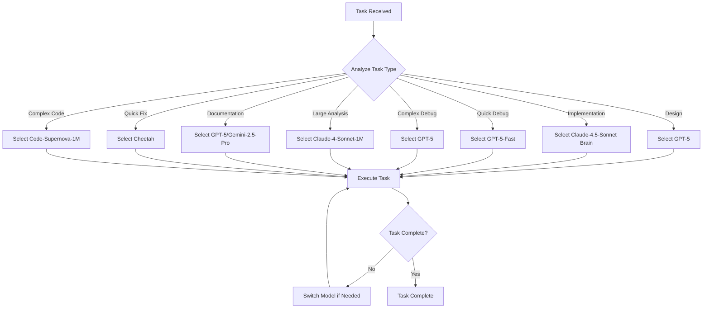

# AI Model Usage Strategy and Selection Rules

## 🎯 Overview

This document defines the strategic use of different AI models within Cursor to optimize development workflow, code quality, and task efficiency. Based on the available models in 2025, each model has specific strengths that should be leveraged for appropriate tasks.

## 🤖 Available Models and Use Cases

### 1. GPT-5 (Brain Icon)
**Primary Strengths:**
- Advanced reasoning and complex problem solving
- Superior code generation and debugging capabilities
- Architecture design and system planning
- Multi-step logical reasoning

**Recommended Use Cases:**
- **System Design**: Complex architecture planning and technical solution design
- **Advanced Debugging**: Deep error analysis and complex troubleshooting
- **Code Review**: Comprehensive code analysis and improvement suggestions
- **Complex Logic**: Multi-step problem solving and algorithm design

**File Patterns:**
- `**/architecture/**/*.md` - System design documents
- `**/docs/**/*.md` - Technical documentation
- `**/*_test.py` - Test files and debugging
- `**/debug_*.py` - Debug scripts
- `**/algorithms/**/*.py` - Complex algorithm implementations

### 2. GPT-5-Fast (Brain Icon)
**Primary Strengths:**
- Fast response with GPT-5 quality
- Quick code generation and fixes
- Rapid prototyping capabilities
- Efficient debugging assistance

**Recommended Use Cases:**
- **Rapid Development**: Fast feature implementation
- **Quick Debugging**: Rapid error identification and fixes
- **Prototyping**: Quick proof-of-concept development
- **Iterative Development**: Fast iteration cycles

**File Patterns:**
- `**/*.py` - Python implementation files
- `**/*.ts` - TypeScript files
- `**/*.tsx` - React TypeScript components
- `**/prototypes/**/*` - Prototype implementations

### 3. Claude-4.5-Sonnet (Brain Icon)
**Primary Strengths:**
- Excellent code generation and implementation
- Multi-file project understanding
- Code refactoring and optimization
- Natural language processing

**Recommended Use Cases:**
- **Code Implementation**: Converting designs to working code
- **Feature Development**: Implementing new functionality
- **Code Refactoring**: Improving existing code structure
- **API Development**: Creating RESTful APIs and endpoints

**File Patterns:**
- `**/*.py` - Python implementation files
- `**/*.ts` - TypeScript files
- `**/*.tsx` - React TypeScript components
- `**/services/**/*.py` - Service layer implementations

### 4. Claude-4.5-Sonnet (Standard)
**Primary Strengths:**
- Reliable code generation
- Good balance of speed and quality
- Consistent performance
- Cost-effective for standard tasks

**Recommended Use Cases:**
- **Standard Development**: Regular coding tasks
- **Feature Implementation**: Standard feature development
- **Code Maintenance**: Regular code updates and fixes
- **Documentation**: Code documentation and comments

**File Patterns:**
- `**/features/**/*.py` - Feature implementations
- `**/components/**/*.tsx` - React components
- `**/utils/**/*.py` - Utility functions

### 5. Claude-4-Sonnet-1M (MAX Only)
**Primary Strengths:**
- Massive context window (1M tokens)
- Large codebase understanding
- Comprehensive analysis capabilities
- Multi-file project comprehension

**Recommended Use Cases:**
- **Large Codebase Analysis**: Analyzing entire projects
- **Comprehensive Refactoring**: Large-scale code improvements
- **System Integration**: Understanding complex system interactions
- **Legacy Code Analysis**: Understanding and modernizing old code

**File Patterns:**
- `**/legacy/**/*` - Legacy code analysis
- `**/integration/**/*` - System integration files
- `**/refactor/**/*` - Large refactoring tasks

### 6. Claude-4.5-Haiku (Brain Icon)
**Primary Strengths:**
- Very fast response times
- Simple code generation
- Quick fixes and small changes
- Cost-effective operations

**Recommended Use Cases:**
- **Quick Fixes**: Simple bug fixes and minor changes
- **Code Formatting**: Code style and formatting tasks
- **Simple Implementations**: Basic functionality implementation
- **Rapid Prototyping**: Quick proof-of-concept development

**File Patterns:**
- `**/utils/**/*.py` - Utility functions
- `**/scripts/**/*.py` - Simple scripts
- `**/*_config.py` - Configuration files
- `**/quickfixes/**/*` - Quick fix implementations

### 7. Gemini-2.5-Pro (Brain Icon)
**Primary Strengths:**
- Large document processing
- Context analysis and summarization
- Multi-language support
- Excellent for research tasks

**Recommended Use Cases:**
- **Large Document Analysis**: Processing extensive documentation
- **Code Analysis**: Analyzing large codebases
- **Data Processing**: Handling large datasets and files
- **Research Tasks**: Information gathering and analysis

**File Patterns:**
- `**/docs/**/*.md` - Large documentation files
- `**/data/**/*.json` - Large data files
- `**/reports/**/*.md` - Analysis reports
- `**/*_analysis.py` - Data analysis scripts

### 8. Code-Supernova-1-Million (Brain Icon)
**Primary Strengths:**
- Specialized for code generation
- Large context window (1M tokens)
- Code-focused reasoning
- Excellent for complex coding tasks

**Recommended Use Cases:**
- **Complex Code Generation**: Large-scale code implementation
- **Code Architecture**: Designing complex code structures
- **Multi-file Development**: Coordinated multi-file implementations
- **Code Optimization**: Advanced code optimization tasks

**File Patterns:**
- `**/core/**/*.py` - Core system implementations
- `**/engines/**/*.py` - Complex engine implementations
- `**/frameworks/**/*` - Framework development

### 9. Cheetah
**Primary Strengths:**
- Ultra-fast response times
- Simple task execution
- Minimal latency
- Cost-effective for basic tasks

**Recommended Use Cases:**
- **Simple Tasks**: Basic code generation and fixes
- **Formatting**: Code formatting and style tasks
- **Quick Responses**: When speed is critical
- **Basic Implementations**: Simple functionality

**File Patterns:**
- `**/simple/**/*` - Simple implementations
- `**/formatting/**/*` - Code formatting tasks
- `**/basic/**/*` - Basic functionality

## 📋 Model Selection Rules

### Automatic Model Selection Based on Task Type

```yaml
Model Selection Matrix:
  System Design:
    Primary: GPT-5
    Fallback: Claude-4.5-Sonnet (Brain Icon)
    Triggers: ["architecture", "design", "planning", "system"]
  
  Code Implementation:
    Primary: Claude-4.5-Sonnet (Brain Icon)
    Fallback: GPT-5-Fast
    Triggers: ["implementation", "coding", "development", "feature"]
  
  Advanced Debugging:
    Primary: GPT-5
    Fallback: GPT-5-Fast
    Triggers: ["debug", "error", "fix", "troubleshoot", "complex"]
  
  Quick Debugging:
    Primary: GPT-5-Fast
    Fallback: Claude-4.5-Haiku (Brain Icon)
    Triggers: ["quick", "simple", "debug", "fix"]
  
  Large Codebase Analysis:
    Primary: Claude-4-Sonnet-1M (MAX Only)
    Fallback: Code-Supernova-1-Million
    Triggers: ["analysis", "large", "codebase", "comprehensive"]
  
  Documentation:
    Primary: GPT-5
    Fallback: Gemini-2.5-Pro
    Triggers: ["documentation", "docs", "readme", "api"]
  
  Large Document Processing:
    Primary: Gemini-2.5-Pro
    Fallback: Claude-4-Sonnet-1M (MAX Only)
    Triggers: ["analysis", "large", "summary", "process", "research"]
  
  Complex Code Generation:
    Primary: Code-Supernova-1-Million
    Fallback: GPT-5
    Triggers: ["complex", "generation", "architecture", "framework"]
  
  Quick Tasks:
    Primary: Cheetah
    Fallback: Claude-4.5-Haiku (Brain Icon)
    Triggers: ["quick", "simple", "format", "style", "basic"]
  
  Standard Development:
    Primary: Claude-4.5-Sonnet (Standard)
    Fallback: Claude-4.5-Sonnet (Brain Icon)
    Triggers: ["standard", "regular", "maintenance", "update"]
```

### Context-Based Model Selection

#### File Size Considerations
```yaml
File Size Rules:
  Small Files (< 1000 lines):
    Recommended: Cheetah or Claude-4.5-Haiku (Brain Icon)
    Reason: Fast response, cost-effective
  
  Medium Files (1000-5000 lines):
    Recommended: Claude-4.5-Sonnet (Brain Icon) or GPT-5-Fast
    Reason: Balanced performance and capability
  
  Large Files (5000-50000 lines):
    Recommended: Claude-4-Sonnet-1M (MAX Only) or Code-Supernova-1-Million
    Reason: Better context handling for large files
  
  Massive Files (> 50000 lines):
    Recommended: Claude-4-Sonnet-1M (MAX Only)
    Reason: Maximum context window for comprehensive analysis
```

#### Task Complexity Matrix
```yaml
Complexity Rules:
  Simple Tasks:
    - Code formatting
    - Simple bug fixes
    - Basic implementations
    - Quick responses
    Model: Cheetah
  
  Medium Tasks:
    - Feature implementation
    - Code refactoring
    - API development
    - Standard debugging
    Model: Claude-4.5-Sonnet (Brain Icon) or GPT-5-Fast
  
  Complex Tasks:
    - System architecture
    - Complex debugging
    - Multi-file refactoring
    - Advanced algorithms
    Model: GPT-5
  
  Analysis Tasks:
    - Large document processing
    - Codebase analysis
    - Research tasks
    - Comprehensive refactoring
    Model: Gemini-2.5-Pro or Claude-4-Sonnet-1M (MAX Only)
  
  Specialized Tasks:
    - Complex code generation
    - Framework development
    - Engine implementation
    - Code architecture
    Model: Code-Supernova-1-Million
```

## 🔧 Implementation Guidelines

### 1. Model Selection Triggers

#### Keyword-Based Selection
```markdown
# Model Selection Keywords

## GPT-5 Triggers
- "design", "architecture", "planning", "system"
- "debug", "error", "troubleshoot", "complex"
- "review", "analyze", "advanced", "algorithm"
- "documentation", "api", "specification"

## GPT-5-Fast Triggers
- "quick", "fast", "rapid", "prototype"
- "debug", "fix", "implement", "iterate"
- "development", "feature", "responsive"

## Claude-4.5-Sonnet (Brain Icon) Triggers
- "implement", "code", "develop", "feature"
- "refactor", "optimize", "improve", "service"
- "api", "endpoint", "integration", "advanced"

## Claude-4.5-Sonnet (Standard) Triggers
- "standard", "regular", "maintenance", "update"
- "routine", "normal", "typical", "common"

## Claude-4-Sonnet-1M Triggers
- "large", "massive", "comprehensive", "analysis"
- "codebase", "legacy", "integration", "refactor"
- "1M", "million", "extensive", "complete"

## Claude-4.5-Haiku Triggers
- "quick", "simple", "fix", "format"
- "style", "clean", "small", "minor"
- "basic", "prototype", "test", "example"

## Gemini-2.5-Pro Triggers
- "large", "big", "extensive", "document"
- "analyze", "summary", "process", "research"
- "data", "file", "content", "analysis"

## Code-Supernova-1-Million Triggers
- "complex", "generation", "architecture", "framework"
- "engine", "core", "advanced", "specialized"
- "million", "large", "comprehensive"

## Cheetah Triggers
- "quick", "fast", "simple", "basic"
- "format", "style", "minimal", "ultra-fast"
- "immediate", "instant", "rapid"
```

#### File Pattern-Based Selection
```yaml
File Pattern Rules:
  Architecture Files:
    Pattern: "**/architecture/**/*.md"
    Model: GPT-5
    Reason: Complex system design requires advanced reasoning
  
  Implementation Files:
    Pattern: "**/*.py", "**/*.ts", "**/*.tsx"
    Model: Claude-4.5-Sonnet (Brain Icon)
    Reason: Code generation and implementation
  
  Large Codebase Files:
    Pattern: "**/legacy/**/*", "**/integration/**/*"
    Model: Claude-4-Sonnet-1M (MAX Only)
    Reason: Large context window for comprehensive analysis
  
  Documentation Files:
    Pattern: "**/docs/**/*.md"
    Model: GPT-5 or Gemini-2.5-Pro
    Reason: Documentation quality and large file handling
  
  Test Files:
    Pattern: "**/*_test.py", "**/test_*.py"
    Model: GPT-5 or GPT-5-Fast
    Reason: Debugging and error analysis
  
  Utility Files:
    Pattern: "**/utils/**/*.py", "**/scripts/**/*.py"
    Model: Cheetah or Claude-4.5-Haiku (Brain Icon)
    Reason: Simple, fast implementations
  
  Complex Engine Files:
    Pattern: "**/engines/**/*.py", "**/core/**/*.py"
    Model: Code-Supernova-1-Million
    Reason: Specialized code generation capabilities
  
  Quick Fix Files:
    Pattern: "**/quickfixes/**/*", "**/formatting/**/*"
    Model: Cheetah
    Reason: Ultra-fast response for simple tasks
```

### 2. Dynamic Model Switching

#### Task-Based Switching


#### Context-Aware Switching
```yaml
Context Switching Rules:
  Multi-File Projects:
    Primary: Claude-4-Sonnet-1M (MAX Only)
    Reason: Better multi-file understanding with large context
  
  Complex Logic:
    Primary: GPT-5
    Reason: Advanced reasoning capabilities
  
  Large Codebases:
    Primary: Code-Supernova-1-Million
    Reason: Specialized code generation with large context
  
  Real-time Development:
    Primary: GPT-5-Fast or Cheetah
    Reason: Fast response times
  
  Research Tasks:
    Primary: Gemini-2.5-Pro
    Reason: Excellent for analysis and research
```

## 📊 Performance Optimization

### 1. Cost Optimization
```yaml
Cost Optimization Strategy:
  High-Value Tasks:
    - System design and architecture
    - Complex debugging
    - Critical code reviews
    - Advanced algorithms
    Model: GPT-5 (premium model for critical tasks)
  
  Standard Tasks:
    - Feature implementation
    - Code refactoring
    - API development
    - Regular debugging
    Model: Claude-4.5-Sonnet (Brain Icon) or GPT-5-Fast (balanced)
  
  Routine Tasks:
    - Code formatting
    - Simple fixes
    - Basic implementations
    - Quick responses
    Model: Cheetah or Claude-4.5-Haiku (Brain Icon) (cost-effective)
  
  Analysis Tasks:
    - Large document processing
    - Data analysis
    - Research tasks
    - Large codebase analysis
    Model: Gemini-2.5-Pro or Claude-4-Sonnet-1M (cost-effective for large tasks)
  
  Specialized Tasks:
    - Complex code generation
    - Framework development
    - Engine implementation
    Model: Code-Supernova-1-Million (specialized capabilities)
```

### 2. Speed Optimization
```yaml
Speed Optimization Strategy:
  Immediate Response Needed:
    Model: Cheetah
    Use Case: Quick fixes, formatting, simple tasks
  
  Fast Development:
    Model: GPT-5-Fast
    Use Case: Rapid prototyping, quick debugging
  
  Standard Development:
    Model: Claude-4.5-Sonnet (Brain Icon)
    Use Case: Regular coding tasks
  
  Complex Analysis:
    Model: GPT-5
    Use Case: Architecture, complex debugging
  
  Large Processing:
    Model: Gemini-2.5-Pro or Claude-4-Sonnet-1M
    Use Case: Document analysis, large codebase research
```

## 🎯 Best Practices

### 1. Model Selection Guidelines
- **Start with the right model**: Choose based on task complexity and requirements
- **Switch when needed**: Don't hesitate to change models if the current one isn't optimal
- **Consider context**: File size, project complexity, and task type matter
- **Balance cost and quality**: Use premium models for critical tasks, cost-effective ones for routine work

### 2. Task-Specific Recommendations
```yaml
Task Recommendations:
  Planning Phase:
    - System architecture: GPT-5
    - Feature planning: GPT-5
    - Technical design: GPT-5
    - Research tasks: Gemini-2.5-Pro
  
  Implementation Phase:
    - Code generation: Claude-4.5-Sonnet (Brain Icon)
    - API development: Claude-4.5-Sonnet (Brain Icon)
    - Feature implementation: GPT-5-Fast
    - Complex frameworks: Code-Supernova-1-Million
  
  Debugging Phase:
    - Error analysis: GPT-5
    - Bug fixing: GPT-5-Fast
    - Performance optimization: GPT-5
    - Quick fixes: Cheetah
  
  Documentation Phase:
    - Technical docs: GPT-5
    - API documentation: GPT-5
    - Large document processing: Gemini-2.5-Pro
    - Research analysis: Gemini-2.5-Pro
  
  Maintenance Phase:
    - Quick fixes: Cheetah
    - Code formatting: Cheetah
    - Simple updates: Claude-4.5-Haiku (Brain Icon)
    - Large refactoring: Claude-4-Sonnet-1M (MAX Only)
  
  Analysis Phase:
    - Large codebase analysis: Claude-4-Sonnet-1M (MAX Only)
    - Legacy code analysis: Claude-4-Sonnet-1M (MAX Only)
    - Data analysis: Gemini-2.5-Pro
    - System integration: Code-Supernova-1-Million
```

### 3. Quality Assurance
- **Verify model selection**: Ensure the chosen model is appropriate for the task
- **Monitor performance**: Track response quality and adjust selection as needed
- **Document decisions**: Record why specific models were chosen for specific tasks
- **Regular review**: Periodically assess and update model selection strategies

## 🔄 Continuous Improvement

### 1. Model Performance Tracking
```yaml
Performance Metrics:
  Response Quality:
    - Code correctness
    - Documentation clarity
    - Solution effectiveness
  
  Response Speed:
    - Time to completion
    - Iteration cycles
    - User satisfaction
  
  Cost Efficiency:
    - Cost per task
    - Value delivered
    - Resource utilization
```

### 2. Strategy Updates
- **Regular assessment**: Monthly review of model performance
- **Strategy refinement**: Update selection rules based on experience
- **New model integration**: Incorporate new models as they become available
- **Team feedback**: Collect and incorporate developer feedback

## 📋 Conclusion

This model selection strategy ensures optimal use of different AI models based on task requirements, file characteristics, and project needs. With the advanced models available in 2025, developers can leverage:

- **GPT-5**: For complex reasoning, system design, and advanced debugging
- **GPT-5-Fast**: For rapid development and quick debugging
- **Claude-4.5-Sonnet (Brain Icon)**: For high-quality code generation and implementation
- **Claude-4.5-Sonnet (Standard)**: For reliable standard development tasks
- **Claude-4-Sonnet-1M (MAX Only)**: For large codebase analysis and comprehensive refactoring
- **Claude-4.5-Haiku (Brain Icon)**: For fast, simple implementations
- **Gemini-2.5-Pro**: For large document processing and research tasks
- **Code-Supernova-1-Million**: For specialized code generation and complex frameworks
- **Cheetah**: For ultra-fast simple tasks and formatting

By following these guidelines, developers can maximize efficiency, minimize costs, and maintain high code quality throughout the development process. The key is to match the right model to the right task, considering factors such as complexity, context size, speed requirements, and cost constraints.

Regular monitoring and adjustment of these strategies will ensure continued optimization of the development workflow, taking full advantage of the advanced AI capabilities available in 2025.

---

*This document provides comprehensive guidance for AI model selection within Cursor, ensuring optimal development efficiency and code quality while managing costs and performance effectively with the latest 2025 AI models.*
